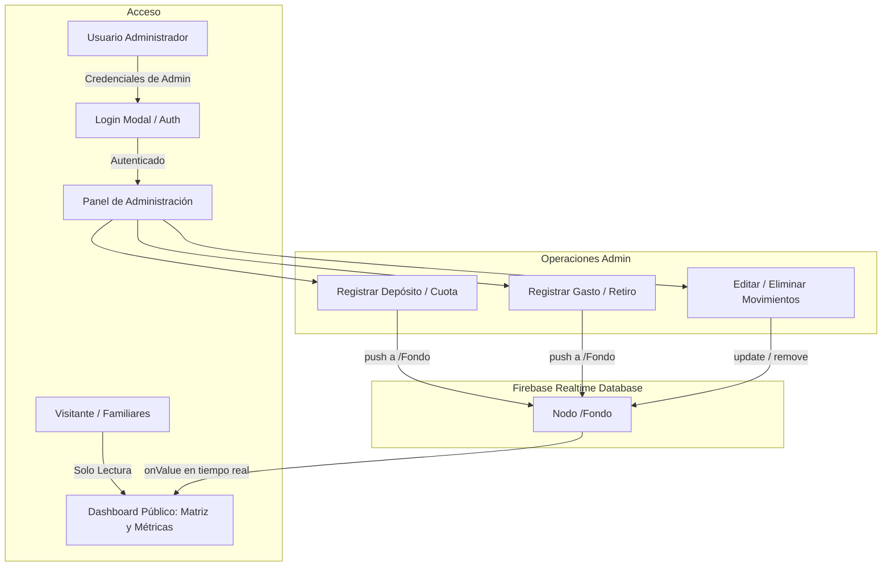

# Plan de Implementación: Panel de Administración Web para Fondo Martínez

## Descripción del Objetivo
Actualmente, los datos de depósitos y gastos consumidos por la aplicación web [fondo_martinez](file:///F:/AndroidStudio/fondo_martinez) eran registrados originalmente desde la aplicación Android (`MBMoney`, específicamente en `AdministracionCoFragment.kt`).

El objetivo es migrar esa capacidad de registro y gestión directamente a la aplicación web, integrando un **Panel de Administración** exclusivo para el administrador. Desde allí se podrán registrar cuotas/depósitos, ingresar gastos, editar y eliminar movimientos, actualizando en tiempo real la base de datos de Firebase Realtime Database (`Fondo`), manteniendo compatibilidad total con la estructura existente y garantizando que solo el administrador pueda realizar estas operaciones.

---

## Método de Autenticación Elegido

> [!IMPORTANT]
> **Firebase Authentication (Email + Contraseña)**
> - Se utiliza el servicio de Firebase Auth oficial del proyecto.
> - Sesión persistente y segura en el navegador.
> - Permite restringir la escritura en Firebase Realtime Database con reglas de seguridad (`auth != null`).

---

## Estructura de Datos (Compatibilidad Android / Web)

Cada registro en Firebase Realtime Database (`Fondo/{id}`) mantiene exactamente el esquema de la aplicación Android:

| Campo | Tipo | Ejemplo Depósito | Ejemplo Gasto |
|---|---|---|---|
| `id` | `string` | `"-O8ABC123..."` | `"-O8DEF456..."` |
| `tipo` | `string` | `"deposito"` | `"gasto"` o `"retiro"` |
| `quien` | `string` | `"Sami Martinez"` | `"Carlos M."` / `"Fondo Común"` |
| `cuanto` | `number` | `50000` | `25000` |
| `fecha` | `number` (timestamp ms) | `1744588800000` | `1744588800000` |
| `creadoEn` | `number` (timestamp ms) | `1744590000000` | `1744590000000` |
| `descripcion` | `string \| null` | `null` o `"Cuota Febrero"` | `"Reparación cerradura"` |
| `soporteUrl` | `string \| null` | `null` o link comprobante | `null` |

---

## Cambios del Sistema

### 1. Servicios y Autenticación Firebase
- **[src/api/firebase.js](file:///F:/AndroidStudio/fondo_martinez/src/api/firebase.js)**: Exporta `auth` con `getAuth(app)`.
- **[src/services/paymentService.js](file:///F:/AndroidStudio/fondo_martinez/src/services/paymentService.js)**: Añade métodos CRUD (`createDeposit`, `createExpense`, `updateFondoItem`, `deleteFondoItem`).

### 2. Contexto de Autenticación
- **[src/context/AuthContext.jsx](file:///F:/AndroidStudio/fondo_martinez/src/context/AuthContext.jsx)**: Manejo global de usuario administrador, inicio de sesión (`signInWithEmailAndPassword`) y cierre de sesión (`signOut`).

### 3. Componentes del Panel de Administración
- **[src/components/admin/AdminLoginModal.jsx](file:///F:/AndroidStudio/fondo_martinez/src/components/admin/AdminLoginModal.jsx)**: Ventana de acceso administrativo con validaciones.
- **[src/components/admin/AdminDashboardModal.jsx](file:///F:/AndroidStudio/fondo_martinez/src/components/admin/AdminDashboardModal.jsx)**:
  - Formulario de Registro de Depósitos / Cuotas con selector de familiares y opción de nuevo nombre.
  - Formulario de Registro de Gastos / Retiros.
  - Pestaña de Historial y Gestión (edición y eliminación con confirmación).
- **[src/App.jsx](file:///F:/AndroidStudio/fondo_martinez/src/App.jsx)**: Botón de acceso de Administrador en el Header, indicador de estado admin, y disparo de modales.

### 4. Reglas de Firebase
- **[firebase-rules.json](file:///F:/AndroidStudio/fondo_martinez/firebase-rules.json)**: Reglas actualizadas para permitir lectura pública y escritura a usuarios autenticados.
